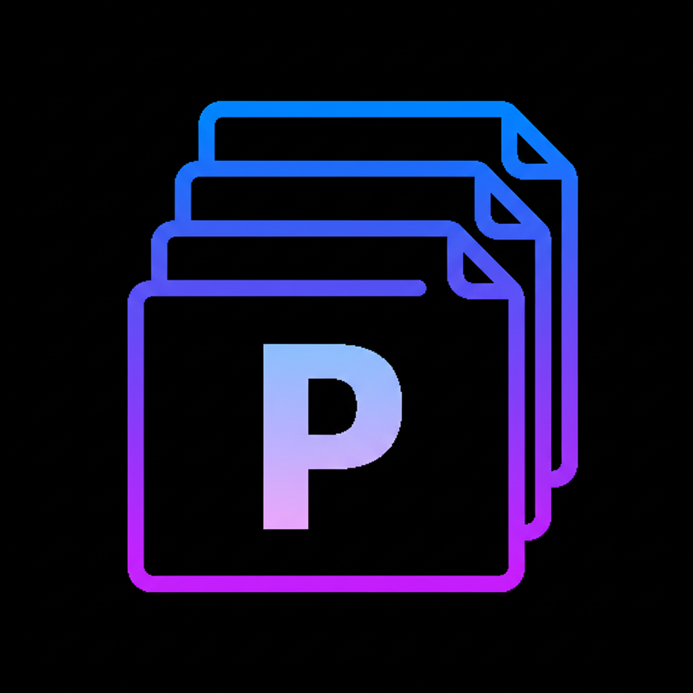

<!-- =============================== -->
<!-- 💫 INTRO ANIMATION SECTION 💫 -->
<!-- =============================== -->

  

<!-- 🌈 Neon Divider -->

  

<!-- =============================== -->
<!-- 🎯 SHORT INTRO TEXT 🎯 -->
<!-- =============================== -->

### 
I'm an AI & Data Science enthusiast 🤖 passionate about building intelligent systems 🧠 and solving real-world problems with machine learning 💡
  

<!-- =============================== -->
<!-- 📚 ABOUT / BADGES SECTION 📚 -->
<!-- =============================== -->

<table align="center">
  <tr>
    <td align="center">
      <!-- 🎓 Education / Focus -->
       
       
      
    </td>
    <td align="center">
      <!-- 💻 Tools & Skills -->
       
       
      
    </td>
    <td align="center">
      <!-- 🌍 Personal Info -->
       
       
      
    </td>
  </tr>
</table>

<!-- 🌈 Neon Divider -->

  

<!-- =============================== -->
<!-- ⚙️ SKILLS SECTION ⚙️ -->
<!-- =============================== -->

## 🛠️ My Skill Set  

<table>
  <tr>
    <!-- 💻 Programming Languages -->
    <td valign="top" width="33%">
      <h3>💻 Programming Languages</h3>
      

        
        
        
        
        
         <!---->
      

    </td>
<!-- 🤖 AI / ML -->
    <td valign="top" width="33%">
      <h3>🤖 AI/ML & Data Science</h3>
      

        
        
        
        <!-- -->
        
        
        
        
      

    </td>
<!-- 🌐 Web / Cloud -->
    <td valign="top" width="33%">
      <h3>🌐 Web & Cloud</h3>
      

        
        
       <!-- -->
        
        
        
        
        
      

    </td>
  </tr>
</table>

<!-- 🌈 Neon Divider -->

  

<!-- =============================== -->
<!-- 🔗 CONNECT SECTION 🔗 -->
<!-- =============================== -->

## 📫 Connect with Me  

  &nbsp;&nbsp;
  &nbsp;&nbsp;
  &nbsp;&nbsp;
  

<!-- 🌈 Neon Divider -->

  

<!-- =============================== -->
<!-- 📊 GITHUB STATS SECTION 📊 -->
<!-- =============================== -->

## 📊 GitHub Stats  
<!-- 📊 GitHub Stats Section -->
<table align="center">
  <tr>
    <!-- Overall GitHub Stats -->
    <td valign="top" width="50%">
      
    </td>
<!-- GitHub Streak Stats -->
    <td valign="top" width="50%">
      
    </td>
  </tr>
</table>

<!-- Language Usage -->

  

<!-- 🌈 Neon Divider -->

  

<!-- =============================== -->
<!-- 📈 CONTRIBUTION GRAPH 📈 -->
<!-- =============================== -->

## 📈 Contribution Activity  

  

<!-- 🌈 Neon Divider -->

  

<!-- =============================== -->
<!-- 💭 DEV QUOTE SECTION 💭 -->
<!-- =============================== -->

## 💭 Random Dev Quote  

  

<!-- 🌈 Neon Divider -->

  

<!-- =============================== -->
<!-- 🌟 OUTRO & PROFILE COUNTER 🌟 -->
<!-- =============================== -->

<!-- Profile Visitor Counter -->

<!-- Outro Typing Animation -->

<!-- Bottom SVG Wave -->

